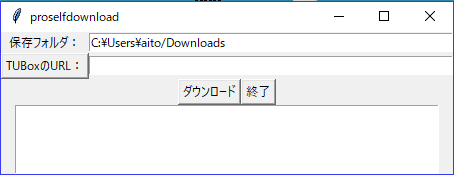

# ProselfDownloader

## これは何？

東北大学メールでは添付ファイルをすべてオンラインストレージProself上に置いてWeb公開している。一定期間後にファイルが消えるのですべてダウンロードして保存しておかなければならないが、メールの添付をすべてダウンロードして整理するのは結構な手間だ。また、メールに記されたリンクを辿ってファイルを選択し、まとめてzipでダウンロードしたあとにzipファイルを解いて内容を整理するのは思った以上に面倒である。

そこで、ダウンロードリンクのURLから直接すべてのファイルをダウンロードするプログラムを書いた。ダウンロードしたファイルは、URL固有の文字列(publicaddress)のフォルダの下にまとめられるので、あとでメールの内容からファイルを探すのもやりやすい。

## 使い方

起動すると次のウィンドウが現れる。

ダウンロード用リンクを[TUBoxのURL:]の右の欄に記入して[ダウンロード]をクリックすると、上の欄に指定したフォルダの下にダウンロードする。[TUBoxのURL:]はボタンになっていて、これを押すとクリップボードの内容を右の欄に貼り付ける。

## 必要なもの

- Tcl/Tk (8.5以上)、tcllib、tls

ここからどうぞ

- [ActiveTcl](https://www.activestate.com/activetcl)
